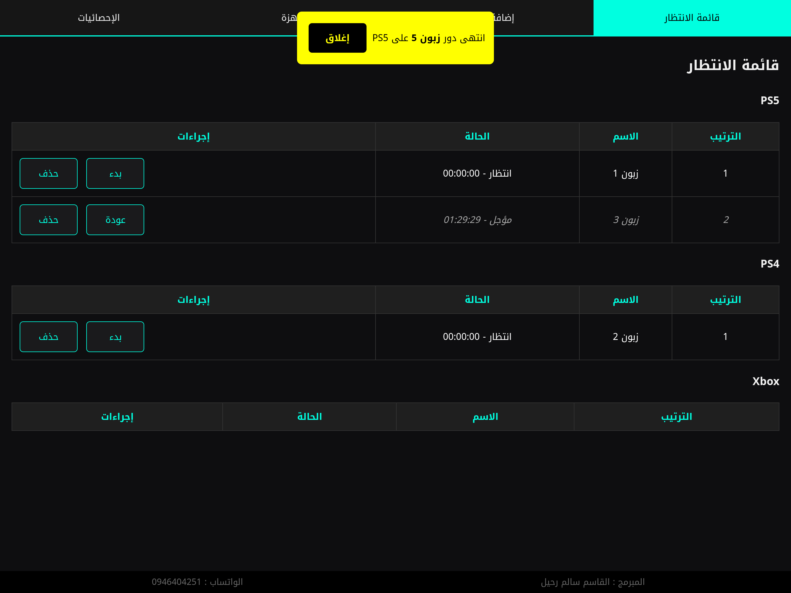
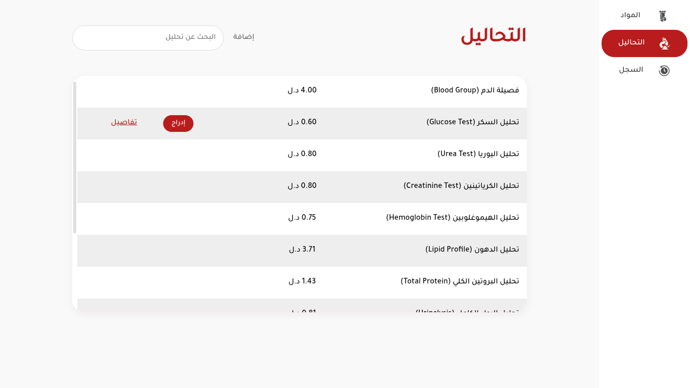
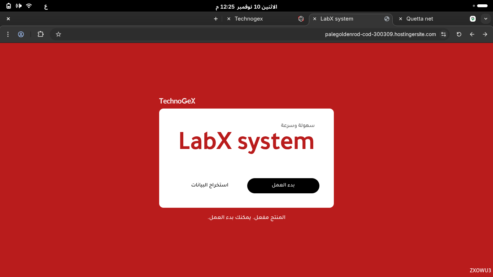
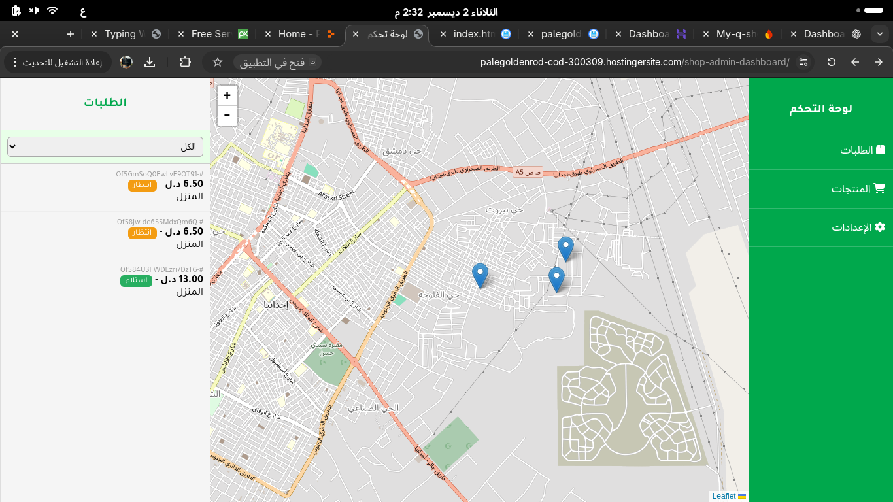
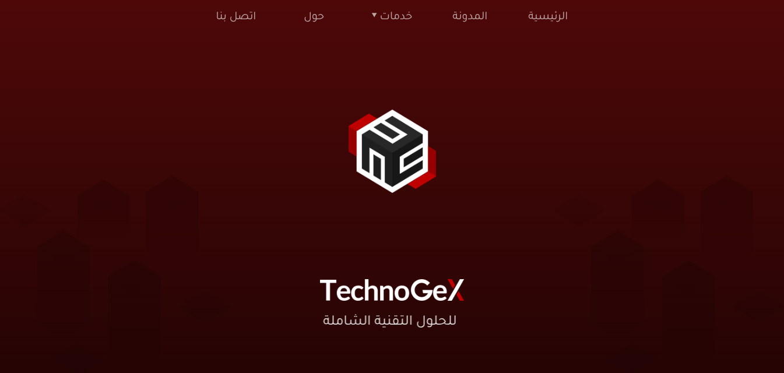
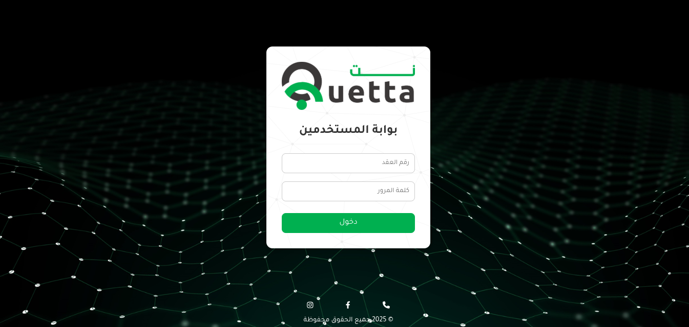

  

  
  
  
  

---

<h1 align="center" dir="rtl" style="font-family: 'Tajawal', sans-serif; font-size: 32px; margin-top: 10px;">
مرحبًا 👋 أنا القاسم
</h1>

أنا مطور تطبيقات ويب وأندرويد من ليبيا 🇱🇾. أعمل على تطوير مشاريع احترافية ومبتكرة، وأركز حاليًا على تعلم React Native، APIs، وتقنيات الذكاء الاصطناعي.  
كما أشارك في تطوير ألعاب فيديو وبرامج تفاعلية، وأسعى دائمًا لتعلم أحدث التقنيات واستخدامها في مشاريع عملية.

---

<h3 align="center" dir="rtl" style="font-size: 26px; margin-bottom: 20px;">
🛠 التقنيات والأدوات التي أعمل بها
</h3>

  
  
  
  
  
  
  
  
  
  

---

<h3 align="center" dir="rtl" style="font-size: 26px; margin-bottom: 25px;">
🌐 بعض المواقع التي شاركت في تطويرها
</h3>

  
  
  
  

---

<h3 align="center" dir="rtl" style="font-size: 26px; margin-bottom: 25px;">
📸 لقطات الشاشة (Screenshots)
</h3>

  
  
  
  
  
  
  
  

